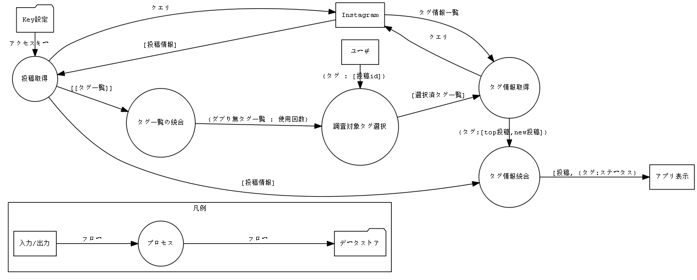

# IG_HASHTAG_ANALYZER

## About

**IG Hashtag Analyzer**は、Instagram投稿のハッシュタグ選択を支援するデスクトップアプリです。  
ただ投稿数が多いだけでなく、自身の投稿が人気投稿になれるハッシュタグを使用することで、  
インプレッション獲得上有利になれると期待できます。

**IG Hashtag Analyzer**は、ユーザの最新9投稿分データを取得し、  
指定したハッシュタグの人気投稿・新着投稿に自分の投稿が含まれているかを分析することができます。  
自分が使ったタグの効果を一目で確認できるので、  
継続使用するタグと別のタグに変更するべきものを捉えて、より効率的に  
自分にあったハッシュタグを探すことができます。

既存のアプリではできない分析を行うため、以下の制約があります。  
また、使用開始前にやや時間のかかる設定作業が必要です。

- Instagramプロアカウント(ビジネスorクリエイター)が必要です。
- 分析できるハッシュタグは一週間に30個までです。

※アプリは完全に無保証です。アプリの利用によるアカウントへの悪影響(アカウントがバンされる・アクションが制限されるなど)は  
起きないはず(開発者が把握している限りの仕様上は)ですが、アカウント・PCへの予期せぬ悪影響がおきる可能性は0ではありません。

## For Developers

### Setup

1. Requirement

- Node.js
- npm

2. IG Hashtag Analyzerのセットアップ

app/以下でターミナルで以下のコマンドを順に実行してください。

```
$ npm install -g electron (for MacOS: $ npm install -g electron --unsafe-perm=true --allow-root)
$ npm install -D electron
$ npm install --save electron-log
$ npm install --save node-fetch
```

3. tokenの設定

```
$ cd token
$ cp token-base.json token.json
```

token.json内の```YOUR-USER-ID```をインスタグラムビジネスアカウントIDで、```YOUR-IGGraphAPI-TOKEN```
を無期限のInstagram Graph API用アクセストークンで置き換えて下さい。  
アクセストークンのスコープは

- pages_show_list
- businness_management
- instagram_basic
- instagram_manage_comments
- instagram_manage_insights
- public_profile

が```Applies to all objects```になっている必要があります。

### Environment variables

開発中は環境変数NODE_ENVを設定してください。token.jsonのパスのスイッチに使用されます。
```
$ $env:NODE_ENV = "development" (For MacOS, Linux : export NODE_ENV="development")
```

開発中のアプリの起動方法はpowershellで
```
$cd app
$ electron.ps1 . (for cmd : electron.cmd .)
```

### Design

**DFD**



**Sequence**


### Development

**Error**

lib/以下のモジュールで例外が発生した場合はすべてAppErrorをthrowします。
AppError([err_handler.js](./app/lib/err_handler.js))は組み込み型Errorの派生クラスで、
codeプロパティ(Instagram Graph APIのエラーコード格納用)とsustainableプロパティ(アプリの強制終了が必要か)を持ちます。
main.js内でcatchされた例外はユーザに表示され、分析の中断またはアプリの終了が行われます。
